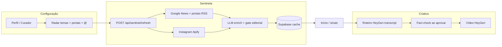

# Arquitetura — Mandato Digital (referência rápida)

## Fluxo principal

## Refresh Sentinela (estado global)

- `ProductAppProvider` → `useSentinelSignalsState`
- `refreshSentinelSignals()` — único POST refresh
- Toast + pill header enquanto `isRefreshingSentinel`
- Poll cache em erro de rede (fallback)

## Pipelines de sinal

| Pipeline | Origem | Peso |
|----------|--------|------|
| `manual` | Temas custom literal | base |
| `portal` | RSS portais + Google site: | alto |
| `semantic` | Termos LLM expandidos | médio |
| `social` | Apify Instagram | engajamento + enrich |

## Curadoria editorial (pós-keyword)

1. Keyword + hashtags strip
2. Heurística ou `sentinel-enrich` (LLM)
3. `creativeWorthy` + `signalKind`:
   - `editorial_opportunity` → Gerar criativo
   - `social_monitoring` → só “Preparar resposta”
   - `social_promoted` → RSS + social correlacionados

## Auth / storage

- Middleware: `src/lib/auth/middleware.ts`
- Perfil: `POST /api/profile`, Supabase `workflow_profile_config`
- Criativos: `creative_projects` table

## Deploy

- `firebase.json` → `alwaysDeployFromSource: true`
- Env: `apphosting.yaml`
- Secrets: `npm run firebase:secrets:guide`
