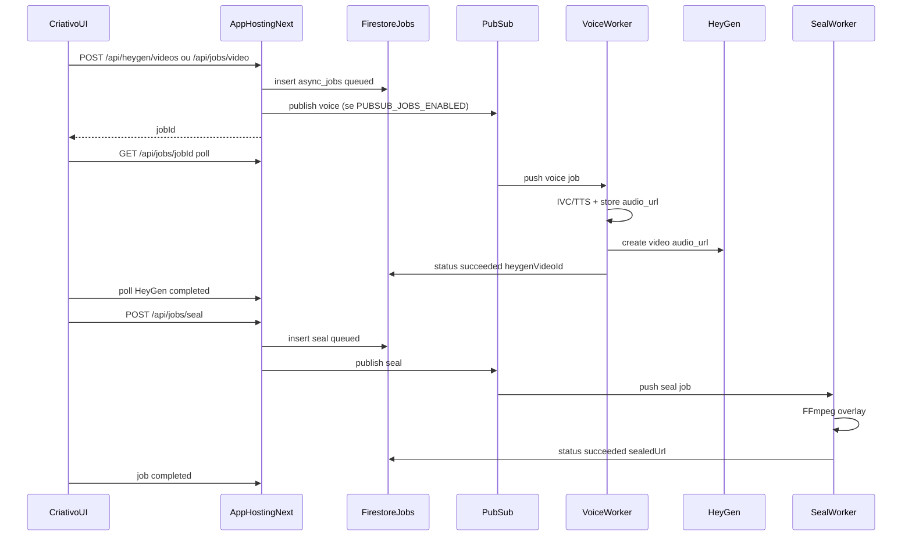

# ADR: filas GCP (piloto Mandato Digital)

Status: **accepted** (2026-07-14)  
Horizonte: piloto → ~100 gerações de vídeo/dia

## Brief para agente arquiteto

```
Papel: Arquiteto de plataforma — Mandato Digital (Firebase App Hosting + Firestore + HeyGen/ElevenLabs).

Horizonte: piloto → ~100 gerações de vídeo/dia (não SaaS multi-tenant enterprise).

Constraints inegociáveis:
- Manter App Hosting / Next.js como API de borda e UI.
- Mínimo de serviços novos no GCP (projeto madatodigital).
- FFmpeg permanece server-side (já em media-tse-seal.ts); seal NÃO fica em Cloud Functions slim.
- Sem BYOK, sem multi-region, sem reescrever Sentinela nesta fase.
- Fonte da verdade de job = Firestore `asyncJobs` (não só Pub/Sub).

Escopo IN:
1. Tabela async_jobs + APIs enqueue/status.
2. Pub/Sub topic(s) + DLQ.
3. Workers HTTP (Cloud Run ou mesmas rotas App Hosting) seal + voice-tts.
4. Migração do Criativo: HTTP só enfileira; UI faz poll de job.
5. Ordem: seal primeiro; voice/TTS no create-video em seguida.

Escopo OUT: Kubernetes, Dataflow, Cloud Tasks como substituto principal,
Functions por endpoint REST, fila no Sentinel refresh, Terraform enterprise completo
(scripts gcloud + doc bastam no MVP).
```

## Decisão

Job Store (`asyncJobs` no Firestore) + Pub/Sub push + workers HTTP:

| Topic | Worker endpoint | Tipo job |
|---|---|---|
| `md-jobs-seal` | `POST /api/workers/seal` | `seal_video` |
| `md-jobs-voice` | `POST /api/workers/voice` | `voice_tts` / create video chain |
| `md-jobs-dlq` | (inspecionar) | dead letters |

Quando `PUBSUB_JOBS_ENABLED` não estiver `true` (dev local / stg sem topics), o publisher **dispara o worker in-process** (fire-and-forget) para não bloquear DX.

Workers rodam no **mesmo App Hosting** no MVP (rotas `/api/workers/*` com auth `JOBS_WORKER_SHARED_SECRET` ou OIDC Pub/Sub). Split para Cloud Run dedicados (`md-seal-worker`, `md-voice-worker`) quando FFmpeg competir com requests UI — ver `scripts/provision-async-jobs-gcp.sh` e `workers/Dockerfile`.

## Arquitetura



## Flags

- `ASYNC_SEAL_ENABLED` / `NEXT_PUBLIC_ASYNC_SEAL_ENABLED` — Criativo enfileira seal e faz poll.
- `ASYNC_VOICE_ENABLED` / `NEXT_PUBLIC_ASYNC_VOICE_ENABLED` — create video (imagem) enfileira TTS+HeyGen.
- `PUBSUB_JOBS_ENABLED` — só então publica; sem isso, kick local do worker.
- Sem flags: paths síncronos `/api/media/seal` e TTS no request permanecem.

## Schema

Collection Firestore `asyncJobs` (campos camelCase). Claim via transaction.

Campos: `id`, `owner_user_id`, `type`, `status`, `payload`, `result`, `attempts`, `max_attempts`, `last_error`, `idempotency_key`, timestamps.

Quota piloto: **1 job in-flight** por owner por tipo (`queued`|`running`).

## Contratos

- `POST /api/jobs/seal` `{ mediaId, videoUrl }` → `{ jobId }` (202)
- `POST /api/jobs/voice` — TTS (+ opcional createVideo)
- `POST /api/jobs/video` — TTS + create HeyGen (exige `createVideo`)
- `GET /api/jobs/[id]` → status/result (só owner)
- `POST /api/workers/seal` / `POST /api/workers/voice` — push Pub/Sub ou secret interno

## Provisionamento GCP (checklist)

Projeto `madatodigital`, region `us-central1`:

1. Rodar `./scripts/provision-async-jobs-gcp.sh <APP_BASE_URL>`
2. Topics `md-jobs-seal`, `md-jobs-voice`, `md-jobs-dlq` + push subscriptions
3. Secret `jobs-worker-shared-secret` (`JOBS_WORKER_SHARED_SECRET`) no App Hosting
4. IAM App Hosting SA: `roles/pubsub.publisher` quando ligar Pub/Sub
5. Flip `PUBSUB_JOBS_ENABLED=true` após smoke local/worker kick
6. (Futuro) SA `md-jobs-worker@...` + Cloud Run dedicados se necessário

## Cutover

1. Deploy indexes Firestore (`npm run firebase:indexes:deploy`)
2. Ship APIs + workers (App Hosting)
3. Stg: `ASYNC_SEAL_ENABLED=true` (+ `NEXT_PUBLIC_*`); sync permanece fallback quando flag off
4. Smoke: gerar vídeo → job seal → Ver vídeo selado
5. Flip Pub/Sub; monitorar DLQ + Cloud Logging
6. Só então `ASYNC_VOICE_ENABLED=true`

## Riscos

- At-least-once Pub/Sub → claim SQL `queued → running`
- URL HeyGen expirar → baixar cedo no worker (`sealRemoteVideo`)
- Cold start / timeout 300s no seal (`maxDuration = 300`)
- Custo Pub/Sub + workers (baixo no volume piloto)
