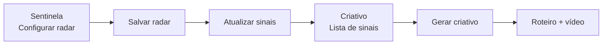

# Sentinela — guia de uso

O **Sentinela** é o agente de monitoramento do Mandato Digital. Ele varre notícias recentes com base no radar configurado e sugere pautas para o **Criativo** produzir vídeos.

Esta versão funciona **sem API key externa**: usa Google News (RSS), feeds dos portais cadastrados e um dicionário de sinônimos por tema.

**URL em produção:** [mandatodigital.web.app/sentinela](https://mandatodigital.web.app/sentinela)

---

## O que o Sentinela faz hoje

| Faz | Ainda não faz |
|-----|----------------|
| Busca matérias no Google News por tema + cidade/estado | Monitorar Instagram, X ou TikTok em tempo real |
| Lê RSS dos portais que você cadastrar | Expansão semântica com IA em tempo real |
| Agrupa cobertura de vários veículos sobre o mesmo assunto | Varredura automática 24h sem você abrir a tela |
| Entrega sinais com link e briefing para o Criativo | Usar perfis @ cadastrados na busca (ficam salvos para evolução futura) |

---

## Pré-requisitos

1. **Estar logado** na aplicação.
2. Ter **cidade e estado** preenchidos no perfil (no **Curador** ou em qualquer tela que salve o perfil). O Sentinela usa essa geografia para priorizar pauta local.
3. Configurar **ao menos um** dos itens abaixo:
   - tema de interesse no radar, **ou**
   - portal/site de interesse ou de oposição.

---

## Passo a passo — configurar o radar

### 1. Abrir o Sentinela

No menu do produto, acesse **Sentinela** (`/sentinela`).

### 2. Aba «1. Temas de interesse»

Esta aba define **o que o mandato quer acompanhar**.

1. **Selecione os temas** clicando nas tags (ex.: Segurança Pública, Vacinação, Reforma Fiscal). Quanto mais alinhado ao mandato, melhor a relevância dos sinais.
2. **Temas personalizados** (opcional): até 3 termos extras, curtos (ex.: `fila do SUS`, `obra na BR-101`). Use para assuntos muito locais ou específicos que não estão na grade.
3. **Perfis de interesse** (opcional): cadastre @ de portais, influenciadores ou veículos. Ficam salvos no perfil; na v1 atual **não entram na busca automática**, mas já ficam registrados para evolução futura.
4. **Portais e sites de interesse** (recomendado): informe domínios como `g1.com.br` ou `portalregional.com.br`. O sistema tenta ler o RSS do site; se não houver feed, busca notícias daquele domínio via Google News.

### 3. Aba «2. Rastreio da oposição»

Esta aba define **o que observar na oposição**.

1. Marque **temas adversários** que merecem resposta rápida.
2. Cadastre **perfis e blogs de oposição** (mesma lógica da aba anterior: portais já entram na busca; perfis @ ficam salvos).

Matérias vindas de portais de oposição ou que batem só em temas adversários recebem prioridade de resposta no score.

### 4. Salvar o radar

Clique em **Salvar radar**.

Aguarde a confirmação: *«Radar do Sentinela salvo com sucesso.»*

> O salvamento usa rascunho do perfil (`allowDraftDefaults`), então você não precisa ter o Curador 100% preenchido só para configurar o Sentinela. Cidade, estado e bio mínima ainda são necessários no backend.

### 5. Atualizar os sinais

Clique em **Atualizar sinais**.

O sistema consulta as fontes, monta o ranking e mostra quantos sinais foram encontrados. Exemplos de feedback:

- *«3 sinal(is) atualizado(s). Veja no Criativo.»*
- *«Nenhum sinal novo encontrado para o radar atual.»*

Os resultados ficam em cache por **15 minutos**. Para forçar nova busca, use **Atualizar sinais** de novo.

---

## Passo a passo — usar os sinais no Criativo

### 1. Abrir o Criativo

Acesse **Criativo** (`/criativo`).

Na seção **Sinais do Sentinela**, a lista carrega automaticamente (mesma API do refresh, respeitando o cache).

### 2. Ler um sinal

Cada card mostra:

| Elemento | Significado |
|--------|-------------|
| **Número grande (score)** | Relevância de 10 a 99: temas batendo, menção local, recência e cobertura em vários veículos |
| **Título** | Tema do radar + manchete da matéria principal |
| **Tags** | Temas do seu radar que casaram com a notícia |
| **Badge «X veículos»** | Vários portais cobriram o mesmo assunto — sinal de pauta em evidência na imprensa |
| **Matérias detectadas** | Links reais para as fontes |

### 3. Gerar criativo

Clique em **Gerar criativo** no card desejado.

Você será levado para `/criativo/novo?sugestao=...` com:

- **Tema** já preenchido no formulário;
- **Banner** com o contexto do Sentinela;
- **Briefing** enviado à IA na geração de roteiro (tema, veículos, links das matérias).

### 4. Produzir a peça

Siga o fluxo normal do Criativo: ajuste enquadramento se quiser, gere roteiro, aprove e produza o vídeo.

---

## Fluxo resumido



---

## Como o sistema busca (referência técnica leve)

Sem precisar configurar nada extra:

1. **Google News RSS** — até 4 temas de interesse + 2 de oposição + 1 busca local (`cidade estado`), combinados com sua geografia.
2. **RSS dos portais** — tenta `/feed`, `/rss`, `/feed.xml` etc.; fallback: `site:dominio.com` no Google News.
3. **Sinônimos** — ex.: tema «Reforma Fiscal» também casa com IVA, CBS, PEC 45; «Vacinação» com vacina, BCG, gripe.
4. **Clustering** — matérias parecidas de veículos diferentes viram um único sinal com score maior.

---

## Dicas para melhores resultados

1. **Seja específico nos temas** — 5–10 temas bem escolhidos valem mais que marcar tudo.
2. **Preencha cidade e estado** — pauta local sobe no ranking.
3. **Cadastre portais da sua região** — reforça cobertura onde o Google News é mais genérico.
4. **Use temas personalizados** para obras, bairros, projetos de lei locais.
5. **Atualize sinais de manhã** — rotina simples antes de escolher a pauta do dia.
6. **Prefira sinais com «2+ veículos»** — indicam assunto com tração editorial, não só uma matéria isolada.

---

## Problemas comuns

### «Configure temas de interesse ou portais no radar do Sentinela.»

Nenhum tema nem portal foi salvo. Volte ao Sentinela, marque ao menos um tema **ou** cadastre um site, e clique em **Salvar radar**.

### «Nenhuma matéria recente encontrada…»

O radar está salvo, mas nada casou nas últimas buscas. Tente:

- Ampliar temas (ex.: incluir sinônimo via tema pai da grade);
- Adicionar um portal regional;
- Conferir se cidade/estado estão corretos no perfil;
- Clicar em **Atualizar sinais** novamente.

### Lista vazia no Criativo, mas o refresh mostrou sinais

Aguarde o carregamento ou recarregue a página. Se persistir, verifique se está logado com o mesmo usuário que salvou o radar.

### Link «Gerar criativo» volta para a listagem

O sinal expirou do cache e não foi reencontrado na nova busca. Atualize os sinais no Sentinela e escolha o card de novo.

### Portal cadastrado não aparece

Nem todo site expõe RSS público. O fallback usa Google News por domínio; sites muito pequenos ou sem indexação podem não retornar nada.

---

## APIs (para integração ou debug)

| Método | Rota | Descrição |
|--------|------|-----------|
| `GET` | `/api/sentinel/suggestions` | Lista sinais do perfil logado |
| `GET` | `/api/sentinel/suggestions/[id]` | Um sinal por ID (usado no editor do Criativo) |
| `POST` | `/api/sentinel/refresh` | Invalida cache e refaz a varredura |

Todas exigem sessão autenticada (401 sem login).

---

## Infraestrutura (Fase 0)

O Sentinela persiste cache e histórico de sinais quando Supabase está configurado (produção) ou em `data/mandato-digital.json` (dev local).

**Migration Supabase (rodar uma vez):**

```bash
npm run db:migrate:sentinel-foundation
# ou cole supabase/migrations/20260624_sentinel_foundation.sql no SQL Editor
```

Tabelas: `sentinel_suggestion_cache`, `sentinel_signals`, `sentinel_theme_expansions` (expansões LLM na Fase 1).

**Feature flags** (todas desligadas por default — ver `src/lib/feature-flags.ts`):

- `SENTINEL_V2_PIPELINES` — 4 pipelines (manual, portal, semântico, social stub)
- `SENTINEL_LLM_EXPANSION` — expansão semântica LLM ao salvar radar
- `SENTINEL_TREND_PROXY` — trend proxy via histórico `sentinel_signals` (volume D vs D-7)
- `SENTINEL_SOCIAL_ENABLED` — Instagram (em breve)
- `SENTINEL_PERSIST_CACHE=false` — desliga persistência mesmo com Supabase
- `AUDITOR_FACTCHECK_ENABLED` — Validador (Fase 2)

---

## Fase 1 — Pipelines e expansão

Com `SENTINEL_V2_PIPELINES=true`:

| Pipeline | Origem | Comportamento |
|----------|--------|---------------|
| **Manual** | 3 temas personalizados | Busca literal (sem sinônimos) |
| **Portal** | Sites cadastrados | RSS + clustering + trend boost |
| **Semântico** | Temas do radar + expansão LLM | Termos correlatos gerados ao salvar |
| **Social** | Perfis @ | Stub até `SENTINEL_SOCIAL_ENABLED` |

Expansão LLM (`SENTINEL_LLM_EXPANSION=true`): ao **Salvar radar**, gera 8–15 termos por tema e persiste em `sentinel_theme_expansions`. UI: bloco “Termos monitorados (expansão)”.

Trend proxy (`SENTINEL_TREND_PROXY=true`): compara volume de sinais nos últimos 7 dias vs 7 dias anteriores (badge “↑ volume” no Criativo).

API extra: `GET /api/sentinel/expansions`

**Dev local (ativar Fase 1):**

```bash
SENTINEL_V2_PIPELINES=true
SENTINEL_LLM_EXPANSION=true
SENTINEL_TREND_PROXY=true
SENTINEL_TREND_PROXY=true
```

---

## Validador (Fase 2)

Com `AUDITOR_FACTCHECK_ENABLED=true` (ligado em prod desde 2026-06-24):

- **Aprovar roteiro** no Criativo dispara fact-check (LLM + URLs do sinal Sentinela)
- Top 10 sinais são validados em background após cada refresh
- Edição pós-aprovação exige checkbox de consentimento antes de produzir vídeo
- Metadados TSE (`aiGenerated`, `sealVersion`) gravados em `creative_projects.metadata`

**Migration:**

```bash
npm run db:migrate:auditor-foundation
```

API: `POST /api/auditor/fact-check`

**Rate limit:** 30 refreshes Sentinela/dia por usuário.

---

## Ver também

- **Curador** — identidade, tom e avatar (necessário para produzir vídeo no Criativo)
- **Criativo** — onde os sinais viram roteiro e vídeo
- README do repositório — deploy e ambiente local
